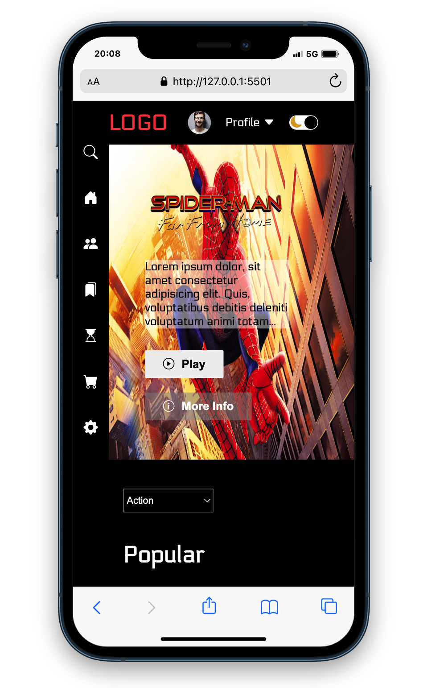
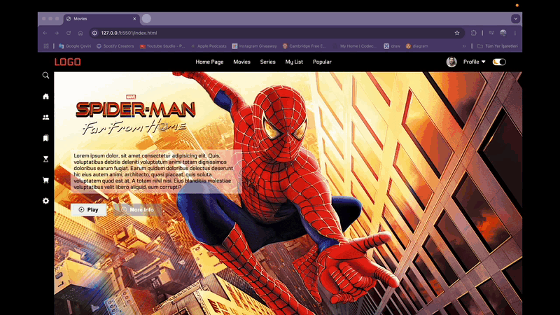

# Movie Project

Bu proje, film tanıtımı ve listeleme amacıyla geliştirilen **Movie Project** isimli bir web uygulamasıdır. **HTML**, **CSS** ve **JavaScript** kullanılarak oluşturulmuş olup **responsive** bir tasarıma sahiptir.

## ✨ Özellikler
- **Responsive Tasarım**: Mobil, tablet ve masaüstü cihazlarda sorunsuz görüntülenme.
- **Film Tanıtımları**: Filmler hakkında bilgiler ve afiş görselleri.
- **Etkileşimli Öğeler**: JavaScript ile dinamik içerik ve kullanıcı deneyimi.

## 📚 Kullanılan Teknolojiler
- **HTML5**
- **CSS3**
- **JavaScript**

## 🚀 Kurulum
Projeyi çalıştırmak için aşağıdaki adımları izleyin:

1. Bu repoyu klonlayın:
   ```bash
   git clone https://github.com/Bahadir34/movie-project.git
   ```
2. Proje klasörüne gidin:
   ```bash
   cd movie-project
   ```
3. `index.html` dosyasını tarayıcınızda açın.

## 🖼️ Ekran Görüntüleri



## 👤 Katkıda Bulunma
Projeye katkıda bulunmak isterseniz **pull request** açabilirsiniz.

## 🌐 Canlı Önizleme


---
_Bu proje yalnızca eğitim amaçlı geliştirilmiştir ve ticari bir amacı bulunmamaktadır._

